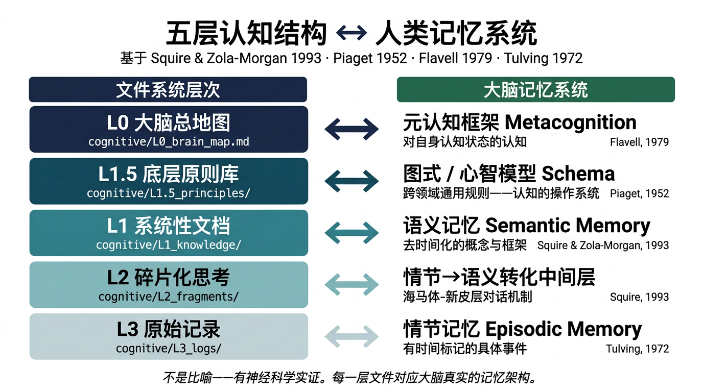
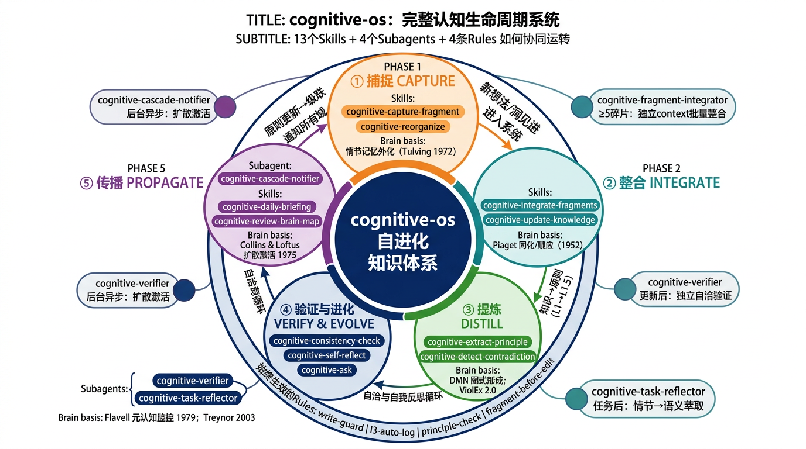
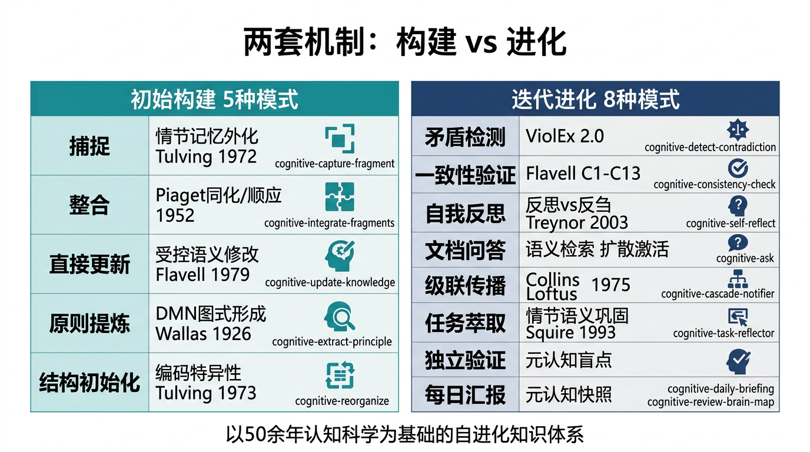

<!-- Logo -->
<p align="center">
  <a href="https://tashan.ac.cn" target="_blank" rel="noopener noreferrer">
    
  </a>
</p>

<!-- 标题 -->
<p align="center">
  <strong>cognitive-os · 认知操作系统</strong><br>
  <em>Cognitive OS — AI-native Knowledge Externalization for Cursor Agents</em>
</p>

<!-- 快速导航 -->
<p align="center">
  <a href="#这是什么">这是什么</a> •
  <a href="#认知科学基础">认知科学</a> •
  <a href="#五层架构">五层架构</a> •
  <a href="#13-个-skill">Skills</a> •
  <a href="#安装方式">安装</a> •
  <a href="#快速开始">快速开始</a> •
  <a href="docs/article/cognitive-science-deep-dive.md">深度解析文章</a> •
  <a href="README.en.md">English</a>
</p>

[](https://opensource.org/licenses/MIT)
[](#20-个-skill)
[](#4-条规则)
[](#4-个子智能体)
[](#认知科学基础)
[](docs/article/cognitive-science-deep-dive.html)

> 把人类大脑的层级记忆结构外化为 AI 可操作的知识体系。20 个 Skills + 4 个 Rules + 4 个 SubAgents，让 AI 智能体能够**构建、维护并自我迭代**用户的认知框架。

---

> 📖 **深度阅读**：[**《把大脑分层外化：一套 AI 认知体系的神经科学解构》**](docs/article/cognitive-science-deep-dive.md)
> 完整解析每个 Skill 与认知科学理论的逐步对应，含 10 张配图（Piaget 同化/顺应、ViolEx 矛盾模型、Wallas 顿悟四阶段、扩散激活……）
> 📎 [HTML 配图完整版（12MB，含 base64 嵌入图片）](docs/article/cognitive-science-deep-dive.html)

---

## 核心架构图

### 静态：五层文件结构 ↔ 大脑记忆系统

> 不是比喻——每一层文件对应神经科学中已被实证的记忆类型



---

### 动态：20 个 Skills 如何协同运转

> 系统总览：五大阶段的完整认知生命周期，含 Subagents 隔离节点和 Rules 守门机制



> 模式详表：初始构建（5 种模式）vs 迭代进化（8 种模式），每种操作对应的认知科学依据



---

## 这是什么

**cognitive-os 解决一个根本问题：**

> **你的最好思考被锁在脑子里——碎片化、自相矛盾、AI 无法触及。**

| 问题 | 表现 | 解决方式 |
|------|------|---------|
| AI 不了解你怎么思考 | 每次问 AI「你觉得怎么样」，它用通用知识回答，不是你的判断 | 把你的认知框架外化，AI 基于**你的文档**回答 |
| 洞见停留在脑子里 | 想到好的观点，没记下来，或记了但找不到 | 碎片捕捉机制，结构化写入分层知识体系 |
| 知识体系自相矛盾 | 不同时期写的文档互相冲突，不知道哪个对 | 矛盾检测 + 版本控制 + 自洽验证，C1-C13 十三条一致性条件 |
| 经验无法自我进化 | 人工智能每次对话都从零开始，无法积累 | 级联通知 + 任务萃取，认知体系在每次工作中自动更新 |

**用一句话描述**：你说「这是我的新洞见」，AI 自动捕捉 → 判断关联 → 整合进你的知识体系 → 矛盾检测 → 级联通知相关模块。

---

## 认知科学基础

这套系统的架构**严格对应**人类大脑的真实记忆层次（非比喻，有神经科学实证）：

| 系统层 | 文件位置 | 大脑对应 | 理论依据 |
|--------|---------|---------|---------|
| **L0** 大脑总地图 | `cognitive/L0_brain_map.md` | 元认知框架 | Flavell (1979) |
| **L1.5** 底层原则库 | `cognitive/L1.5_principles/` | 图式/心智模型 Schema | Piaget (1952) |
| **L1** 系统性文档 | `cognitive/L1_knowledge/` | 语义记忆 Semantic Memory | Squire & Zola-Morgan (1993) |
| **L2** 碎片化思考 | `cognitive/L2_fragments/` | 情节→语义转化中间层 | 海马体-新皮层对话 |
| **L3** 原始记录 | `cognitive/L3_logs/` | 情节记忆 Episodic Memory | Tulving (1972) |

每种认知操作也有对应的认知科学机制：

| 操作 | Skill | 认知科学机制 | 文献依据 |
|------|-------|------------|---------|
| 碎片捕捉 | `cognitive-capture-fragment` | 情节记忆外化 + 来源监控 | Tulving (1972) |
| 碎片整合（小人机制）| `cognitive-integrate-fragments` | Piaget 同化/顺应 | Piaget (1952) |
| 直接更新知识 | `cognitive-update-knowledge` | 语义记忆受控修改 ceremony(K) | 形式规范；Flavell 1979 |
| 原则提炼 | `cognitive-extract-principle` | DMN 后台加工 → 图式形成 | Wallas (1926); Collins & Loftus (1975) |
| 矛盾检测 | `cognitive-detect-contradiction` | ViolEx 2.0 图式违反处理 | Gawronski & Brannon (2022) |
| 自我反思 | `cognitive-self-reflect` | 反思 vs 反刍神经机制 | Treynor et al. (2003) |
| 级联传播 | `cognitive-cascade-notifier` | 扩散激活 Spreading Activation | Collins & Loftus (1975) |
| 任务萃取 | `cognitive-task-reflector` | 情节→语义转化（记忆巩固）| Squire (1993) |

---

## 五层架构

```
╔══════════════════════════════════════════════════════════════╗
║  L0  大脑总地图（元认知层）                                    ║
║  读完 = 恢复所有上下文；维护协议见 maintenance_protocol.md    ║
╚═══════════════════════════╤══════════════════════════════════╝
                            ↕ 约束↑ / 提炼↓
┌───────────────────────────────────────────────────────────────┐
│  L1.5  底层原则库（图式层）                                    │
│  跨领域通用的核心思维习惯，是认知的「操作系统」                  │
│  P1：验证优先于感受    P2：从小点切入升维到底层规律             │
└───────────────────────┬───────────────────────────────────────┘
                        ↕ 约束↓ / 提炼↑
╔══════════════════════════════════════════════════════════════╗
║  L1  系统性文档（语义记忆）                                    ║
║  去时间化、跨场景成立的知识框架（按领域组织）                   ║
╚══════════════════════╤═══════════════════════════════════════╝
                       ↕ 小人整合机制（Piaget同化/顺应）
┌──────────────────────────────────────────────────────────────┐
│  L2  碎片化思考（情节→语义转化层）                              │
│  待整合的原材料：新洞见、自我反思、技术发现                     │
│  fragment_index.md 追踪每条碎片状态                            │
└──────────────────────┬───────────────────────────────────────┘
                       ↓ 全记录
┌──────────────────────────────────────────────────────────────┐
│  L3  原始记录（情节记忆）                                       │
│  system_log.md（操作日志）  todo.md  consistency_record.md    │
└──────────────────────────────────────────────────────────────┘
```

**三大闭环中的位置**：cognitive-os 实现的是 **Loop 2（认知系统）**——让系统「知道为什么」。它与 [tashan-cursor-skills](https://github.com/TashanGKD/tashan-cursor-skills)（Loop 1 执行系统）配合，形成完整的自进化 AI 系统。

---

## 13 个 Skill

### 初始构建（5 种模式）

| Skill | 触发词 | 作用 | 认知科学 |
|-------|--------|------|---------|
| `cognitive-capture-fragment` | 碎片/记录一下/新洞见/我发现 | 捕捉碎片想法，写入 L2，带归因标注 | 情节记忆外化 |
| `cognitive-integrate-fragments` | 整合碎片/处理积压/消化碎片 | 将 L2 碎片整合进 L1（小人机制：同化/顺应/已覆盖）| Piaget 平衡化 |
| `cognitive-update-knowledge` | 更新[文档]/修改[文档]/在[文档]里加上 | 受控更新 L1 文档：备份→归因→矛盾检测→5处级联写入 | ceremony(K) 协议 |
| `cognitive-extract-principle` | 提炼原则/有什么规律/底层逻辑 | 从 L2 碎片中提炼跨领域通用原则，写入 L1.5 | DMN 图式形成 |
| `cognitive-reorganize` | 系统整理/重组认知结构/认知结构乱了 | 从零/散落文档构建认知结构，四轴分类 | 记忆系统首次结构化 |

### 迭代进化（8 种模式）

| Skill | 触发词 | 作用 | 认知科学 |
|-------|--------|------|---------|
| `cognitive-detect-contradiction` | 矛盾/不一致/检查一致性 | 5类矛盾检测 + ViolEx 防御模式追踪（C13）| ViolEx 2.0 |
| `cognitive-consistency-check` | 一致性检查/自洽检查/跑一遍验证 | C1-C13 完整自洽验证，发现立即修复 | Flavell 元认知监控 |
| `cognitive-self-reflect` | 反思/我发现我有个习惯/我注意到 | 10轮追问+5维度深挖，内置反刍检测 | Treynor 2003 反思/反刍 |
| `cognitive-ask` | 基于我的文档/根据我的想法/帮我回忆 | 严格基于你自己的文档回答，标注来源和置信度 | 语义记忆检索 |
| `cognitive-daily-briefing` | 汇报/今天有什么/同步状态 | 生成认知系统每日状态报告 | 情节记忆更新综述 |
| `cognitive-review-brain-map` | 大脑地图/认知状态/系统状态 | 生成当前认知结构状态快照 | 元认知快照 |
| `cognitive-version-snapshot` | 创建新版本/打快照/这次改动很大 | 为 L1 文档创建重大版本里程碑 | 长期记忆巩固 |
| `cognitive-input-classifier` | 帮我判断/先分类/路由分类一下 | 输入路由分类器（认知更新 vs 任务执行）| 认知分类前置 |
| `cognitive-work-alignment-check` | 检查工作与认知的对齐/认知根对齐/认知-工作自洽 | 验证工作产出是否可追溯到 L1.5原则/L1文档，识别「漂浮工作」| Flavell元认知监控 |

### 扩展能力（6 种，v1.2 新增）

| Skill | 触发词 / 调用方式 | 作用 | 认知科学 |
|-------|-----------------|------|---------|
| `cognitive-attend` | 检查这段话有没有认知信号/帮我识别洞见 | 主动检测对话中隐含的五类认知信号（洞见/联想/矛盾/反思/原则），路由给对应 Skill | 突显网络 SN；Corbetta 2002 |
| `cognitive-associate` | 内部工具（被 cognitive-ask 和 cognitive-capture-fragment 调用）| 给定概念，在知识图谱中激活语义相邻的概念网络，返回 Top-5 邻居 | Collins & Loftus 1975 扩散激活 |
| `cognitive-consolidate` | 后台调度（每7天）/ 人工：批量整合积压碎片 | 将积压的成熟L2碎片批量整合进L1，冲突类碎片记录待决策（Headless模式）| Wilson & McNaughton 1994 记忆巩固 |
| `cognitive-calibrate` | 验证历史内容/校准知识置信度/哪些内容还没验证 | 追踪🟡AI生成内容是否事后得到验证，防止未验证推断长期被当事实 | Flavell 1979 元认知监控准确性 |
| `cognitive-background-synthesizer` | 后台调度（每3天）/ 人工：执行后台合成 | 跨碎片关联分析，找隐性连接，生成合成报告（Headless模式）| Buckner 2008 DMN；Kounios 2014 顿悟 |
| `cognitive-creative-synthesis` | 没有思路/换个角度想/帮我发散一下/跨领域看这个问题 | 从认知体系随机抽取跨领域概念，强制寻找结构相似性，生成非常规解法候选 | Beaty 2016 DMN+CEN协同；Mednick 1962 远距联想 |

---

## 4 个子智能体

| SubAgent | 作用 | 独立 Context 价值 |
|---------|------|-----------------|
| `cognitive-verifier` | L1 更新后自洽验证（CV-1/CV-2/CV-3）| 独立「读者」视角，避免创作者视角偏差 |
| `cognitive-fragment-integrator` | ≥5条碎片时批量整合 | 纯粹小人视角，不被碎片捕捉历史污染 |
| `cognitive-cascade-notifier` | 原则/L1重大更新后后台级联通知 | 后台异步，不阻断主流程，扩散激活等价 |
| `cognitive-task-reflector` | 认知类任务完成后自动萃取认知价值 | 脱离操作细节，以「认知体系维护者」视角分析 |

---

## 4 条规则

| Rule | 类型 | 作用 |
|------|------|------|
| `cognitive-structure-write-guard` | 条件触发 | 写入 L1/L1.5 前：强制备份 + 归因标注 + 5处级联写入 |
| `cognitive-l3-auto-log` | alwaysApply | 每次 cognitive-* 操作后：自动追加系统日志 |
| `cognitive-principle-check` | 条件触发 | 写完 L1 内容后：自动校验与 P1/P2 的张力 |
| `fragment-before-direct-edit` | 条件触发 | 直接改 L1 前：提示「先记碎片还是直接改？」|

---

## 安装方式

### 方式一：`ai-agent-skills` CLI（推荐，一行命令）

```bash
# 安装到当前项目
npx ai-agent-skills install TashanGKD/cognitive-os

# 或安装到全局（所有 Cursor 项目可用）
npx ai-agent-skills install --global TashanGKD/cognitive-os
```

安装完成后，还需要初始化认知结构模板：

```bash
# 初始化 cognitive/ 目录（首次使用）
./scripts/setup.sh
```

### 方式二：Cursor 内置 GitHub 导入

1. 打开 Cursor 设置（`Cmd+Shift+J`）
2. 进入 **Rules** → **Add Rule** → **Remote Rule (Github)**
3. 输入：`https://github.com/TashanGKD/cognitive-os`
4. 重启 Cursor

### 方式三：手动复制（完全控制）

```bash
git clone https://github.com/TashanGKD/cognitive-os.git

# 复制 Skills/Rules/Agents
cp -r cognitive-os/skills/* your-project/.cursor/skills/
cp -r cognitive-os/rules/* your-project/.cursor/rules/
cp -r cognitive-os/agents/* your-project/.cursor/agents/

# 初始化认知结构模板
cd cognitive-os && ./scripts/setup.sh /path/to/your-project
```

重启 Cursor，所有 Skill 和 Rule 自动生效。

---

## 快速开始

安装完成后，在 Cursor 对话框里说：

```
# 1. 初始化你的认知结构
"帮我系统整理我的认知结构"
→ cognitive-reorganize Skill 引导你四轴分类所有文档

# 2. 记录一个新想法
"碎片：我发现每次压力大的时候，我会跳过验证步骤"
→ cognitive-capture-fragment 自动结构化写入 L2

# 3. 整合积压的碎片
"整合这些碎片"
→ cognitive-integrate-fragments 按 Piaget 同化/顺应机制整合

# 4. 提炼底层规律
"这些碎片有没有共同的底层规律？提炼原则"
→ cognitive-extract-principle 跨域分析，≥3个领域才确认

# 5. 问你自己的文档
"基于我的文档，我对产品设计的核心观点是什么？"
→ cognitive-ask 严格引用你的 L1/L1.5/L2，标注来源

# 6. 每日认知汇报
"今天认知系统有什么更新？"
→ cognitive-daily-briefing 生成积压/更新/待处理报告

# 7. 主动检测对话中的认知信号
"帮我检查这段话有没有值得记录的"
→ cognitive-attend 扫描 S1-S5 五类信号，路由给对应 Skill

# 8. 思路瓶颈时的创造性发散
"没有思路了，换个角度想想"
→ cognitive-creative-synthesis 从认知体系随机抽取跨领域概念，强制找结构类比

# 9. 验证 AI 推断内容的准确性（季度性使用）
"哪些内容是 AI 推断的，还没验证过？"
→ cognitive-calibrate 扫描 🟡 归因内容，逐条确认是否有实际证据
```

---

## 代码结构

```
cognitive-os/
├── README.md                     # 本文件（中文）
├── README.en.md                  # English version
├── LICENSE                       # MIT
│
├── skills/                       # 13 个 Skills（供 ai-agent-skills CLI 安装）
│   ├── cognitive-capture-fragment/SKILL.md
│   ├── cognitive-integrate-fragments/SKILL.md
│   ├── cognitive-update-knowledge/SKILL.md
│   ├── cognitive-extract-principle/SKILL.md
│   ├── cognitive-detect-contradiction/SKILL.md
│   ├── cognitive-ask/SKILL.md
│   ├── cognitive-self-reflect/SKILL.md
│   ├── cognitive-daily-briefing/SKILL.md
│   ├── cognitive-review-brain-map/SKILL.md
│   ├── cognitive-consistency-check/SKILL.md
│   ├── cognitive-reorganize/SKILL.md
│   ├── cognitive-input-classifier/SKILL.md
│   ├── cognitive-version-snapshot/SKILL.md
│   ├── cognitive-work-alignment-check/SKILL.md
│   │
│   ├── # 扩展能力层（v1.2 新增，含 SN/DMN/联想/巩固/校准）
│   ├── cognitive-attend/SKILL.md
│   ├── cognitive-associate/SKILL.md
│   ├── cognitive-consolidate/SKILL.md
│   ├── cognitive-calibrate/SKILL.md
│   ├── cognitive-background-synthesizer/SKILL.md
│   └── cognitive-creative-synthesis/SKILL.md
│
├── rules/                        # 4 个 Rules（alwaysApply 或条件触发）
│   ├── cognitive-structure-write-guard.mdc
│   ├── cognitive-l3-auto-log.mdc
│   ├── cognitive-principle-check.mdc
│   └── fragment-before-direct-edit.mdc
│
├── agents/                       # 4 个 SubAgents（独立 context）
│   ├── cognitive-verifier.md
│   ├── cognitive-fragment-integrator.md
│   ├── cognitive-cascade-notifier.md
│   └── cognitive-task-reflector.md
│
├── cognitive/                    # 认知结构模板（用户自定义内容）
│   ├── L0_brain_map.md           # 元认知总地图模板
│   ├── maintenance_protocol.md   # C1-C13 自洽规范
│   ├── document_catalog.md       # 文档分类清单
│   ├── knowledge_graph.md        # 知识图谱
│   ├── work_domains.md           # 工作域定义（cascade 通知用）
│   ├── L1.5_principles/
│   │   └── principles.md         # 底层原则库模板（含 P1/P2）
│   ├── L1_knowledge/
│   │   └── README.md             # L1 组织指南
│   ├── L2_fragments/
│   │   ├── fragment_index.md     # 碎片索引模板
│   │   └── reflections/
│   │       └── reflections.md    # 自我反思记录模板
│   └── L3_logs/
│       ├── system_log.md         # 系统日志模板
│       ├── todo.md               # 待完成清单模板
│       └── consistency_record.md # 一致性检查记录模板
│
├── .cursor/                      # 同上（直接作为 Cursor workspace 时使用）
│   ├── skills/                   # 与 skills/ 保持同步
│   ├── rules/                    # 与 rules/ 保持同步
│   └── agents/                   # 与 agents/ 保持同步
│
├── docs/
│   ├── assets/tashan.svg                     # 他山 Logo
│   └── article/
│       ├── cognitive-science-deep-dive.md    # ★ 深度解析文章（Markdown，可直接阅读）
│       └── cognitive-science-deep-dive.html  # ★ 同上，含 10 张配图的 HTML 完整版（12MB）
│
├── logs/
│   └── task_log.md               # 任务日志模板
│
└── scripts/
    └── setup.sh                  # 一键初始化脚本
```

---

## 生态位置

```
他山生态
├── Resonnet / tashan-openbrain   ← 多智能体认知协作平台（使用者）
├── Tashan-TopicLab               ← 多专家圆桌讨论
├── tashan-cursor-skills          ← Loop 1：AI 执行规范体系（Skill 执行）
├── cognitive-os ★                ← Loop 2：认知操作系统（本仓库）
└── world-axiom-framework         ← 数字世界公理框架（理论基础）
```

| 仓库 | 定位 | 链接 |
|------|------|------|
| tashan-cursor-skills | Loop 1 执行体系（95 Skills + 32 Rules） | [TashanGKD/tashan-cursor-skills](https://github.com/TashanGKD/tashan-cursor-skills) |
| Resonnet | 多智能体认知协作后端 | [TashanGKD/Resonnet](https://github.com/TashanGKD/Resonnet) |
| world-axiom-framework | 数字世界公理框架 | [TashanGKD/world-axiom-framework](https://github.com/TashanGKD/world-axiom-framework) |

**与 tashan-cursor-skills 的关系**：
- `tashan-cursor-skills` = Loop 1（让 AI 知道**怎么做**）
- `cognitive-os` = Loop 2（让 AI 知道**为什么**）
- 两者配合 = AI 既有执行规范，又有认知根基

---

## 参考文献

1. Tulving, E. (1972). Episodic and semantic memory.
2. Squire, L. R., & Zola-Morgan, S. (1993). The medial temporal lobe memory system. *Science*, 253(5026).
3. Flavell, J. H. (1979). Metacognition and cognitive monitoring. *American psychologist*, 34(10).
4. Piaget, J. (1952). *The origins of intelligence in children*. International Universities Press.
5. Collins, A. M., & Loftus, E. F. (1975). A spreading-activation theory of semantic processing. *Psychological review*, 82(6).
6. Wallas, G. (1926). *The art of thought*.
7. Treynor, W., et al. (2003). Rumination reconsidered. *Cognitive therapy and research*, 27(3).
8. Gawronski, B., & Brannon, S. M. (2022). What is cognitive consistency? *Dual-process theories of the social mind*.

---

## 贡献

欢迎 Issue 和 PR。修改任何 Skill/Rule/Agent 前，参考 `skills/cognitive-consistency-check/SKILL.md` 中的 C12 自洽条件，确保修改有认知科学对应标注。

---

## 许可证

MIT License. See [LICENSE](LICENSE) for details.
